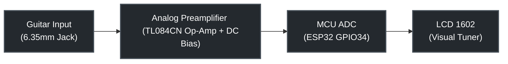

# Chromatic Guitar Tuner using ESP32

An advanced, real-time digital chromatic guitar tuner implemented on the **ESP32** microcontroller. The system captures analog signals directly from an electric guitar via a 6.35 mm Jack input, performs real-time digital signal processing (DSP) using Fast Fourier Transform (FFT), and visualizes the tuning deviation (in cents) on a 1602 LCD display.

This project was developed as a team project at **Wrocław University of Science and Technology** (Politechnika Wrocławska).

---

## 📌 Features

- **Real-Time DSP Pipeline:** High-speed fundamental frequency ($f_0$) estimation using the Fast Fourier Transform.
- **Hardware-Optimized Frequency Resolution:** Tuned specifically to achieve high accuracy in the lower guitar register (essential for low E and bass strings).
- **Signal Conditioning Support:** Tailored to work with an active operational amplifier (Op-Amp) preamplifier circuit.
- **Dynamic Noise Floor & Filtering:** Software-defined noise gating and DC offset removal to eliminate ambient noise and harmonic artifacts.
- **Visual Feedback:** Custom font characters generated on the LCD 1602 to provide a high-precision tuning cent-deviation bar indicator.

---

## 📐 System Architecture & Signal Chain

The hardware stack is divided into an analog front-end for signal conditioning and a digital back-end handled by the MCU.

### 1. Analog Front-End (Conditioning)
An electric guitar's electromagnetic pickups produce a weak AC voltage (typically sub-1V) containing negative voltage components. Connecting this directly to an MCU would cause signal clipping and damage the chip. 
The system utilizes a **TL084CN** operational amplifier configuration to:
- Provide high input impedance to preserve guitar tone.
- Amplify the weak signal using a non-inverting amplifier topology ($A_V = 1 + \frac{R_F}{R_2}$).
- Shift the AC signal by a constant DC offset bias (approx. $1.65\text{V}$) into the safe, positive voltage domain ($0 - 3.3\text{V}$) required by the ESP32.

### 2. Digital Back-End (Evolution: Arduino vs. ESP32)
While early prototyping was done using standard Arduino boards, the project successfully migrated to the **ESP32** to fulfill strict real-time execution and memory boundaries.

| Parameter | Prototyping Phase (Arduino) | Production Phase (ESP32) | Technological Impact |
| :--- | :---: | :---: | :--- |
| **MCU Clock Speed** | 16 MHz | **240 MHz** | Faster computation allows for deeper mathematical arrays. |
| **ADC Resolution** | 10-bit ($0 - 1023$) | **12-bit ($0 - 4095$)** | 4x higher voltage sensitivity for fine audio nuances. |
| **FFT Buffer ($N$)** | 128 samples | **1024 samples** | 8x larger buffer size drastically increases frequency bin resolution. |
| **Sampling Freq ($f_s$)** | 4800 Hz | **4000 Hz** | Optimized to compress bandwidth and focus on the guitar spectrum. |
| **Frequency Delta ($\Delta f$)**| $\sim 37.5\text{ Hz}$ | **$\sim 3.9\text{ Hz}$** | Bin step size reduced by **90%**, crucial for low-frequency tuning. |
| **Noise Floor Gate** | 50.0 | **300.0** | Calibrated against the expanded dynamic range of the 12-bit ADC. |

---

## 💻 DSP Algorithm & Mathematical Model

The firmware utilizes `arduinoFFT.h` to convert time-domain audio samples into the frequency domain.

### 1. Pre-Processing & Windowing
To counteract spectral leakage caused by finite-time window sampling, a **Hamming Window** is applied to the raw discrete input vector $x[n]$:
$$w[n] = 0.54 - 0.46 \cos\left(\frac{2\pi n}{N-1}\right)$$
The static DC component is dynamically calculated and subtracted programmatically by centering the sample values around their mean average:
$$x_{\text{centered}}[n] = x[n] - \frac{1}{N}\sum_{i=0}^{N-1} x[i]$$

### 2. Frequency Estimation & Cent Deviation Logic
Upon executing the forward FFT and finding the primary peak frequency $f_0$, the system translates the absolute frequency value into the logarithmic Western musical scale utilizing the **MIDI Standard Note Formula**:
$$m = 12 \cdot \log_2\left(\frac{f_0}{440}\right) + 69$$

The fractional part of $m$ defines the cent deviation (ranging from $-50$ to $+50$ cents), which maps linearly across the 16 columns of the LCD interface:
$$\text{Cents} = (m - \lfloor m \rceil) \cdot 100$$

---

## 🔌 Circuit Pinout & Wiring

### ESP32 to LCD 1602 (4-bit Mode Connection)
| LCD 1602 Pin | ESP32 GPIO | Description |
| :---: | :---: | :--- |
| **RS** | `GPIO 13` | Register Select |
| **E** | `GPIO 12` | Enable Signal |
| **D4** | `GPIO 14` | Data Bus Line 4 |
| **D5** | `GPIO 27` | Data Bus Line 5 |
| **D6** | `GPIO 26` | Data Bus Line 6 |
| **D7** | `GPIO 25` | Data Bus Line 7 |
| **VSS / VDD / V0** | `GND / 5V / Potentiometer` | Power & Contrast management |

### Audio Signal Input
- **Pre-Amp Output:** Tied directly to **`GPIO 34`** (ADC1_CH6 on ESP32).

---

## 🛠️ Installation & Compilation

1. **Prerequisites:** Download and set up the [Arduino IDE](https://www.arduino.cc/en/software) or platformio.
2. **Board Support Package:** Install the official **esp32** board definitions via the Arduino Boards Manager.
3. **Library Dependencies:** Install the following packages via the Library Manager:
   - `arduinoFFT` (Ensure version compatibility with template arguments `ArduinoFFT<float>`)
   - `LiquidCrystal`
4. **Hardware Assembly:** Reference the repository schematics to build the TL084CN-based operational amplifier circuit.
5. **Deployment:** Open `/src/guitar_tuner_esp32.ino`, select your ESP32 target module, choose the correct COM port, and flash the binary.

---

## 👥 Project Contributors

This project was built from scratch as part of a university team collaboration by:
- **Mateusz Gocki**
- **Piotr Skrzyński**
- **Szymon Tront**
- **Marceli Błaszczyk**
- **Jakub Donocik**

---

